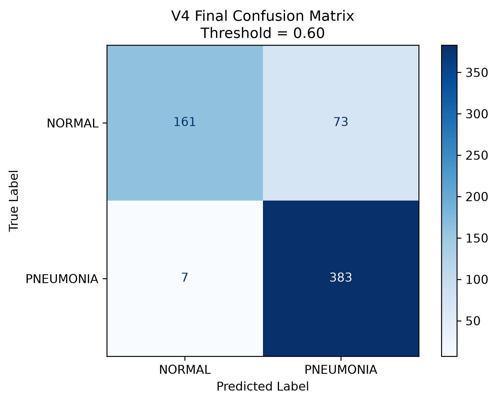
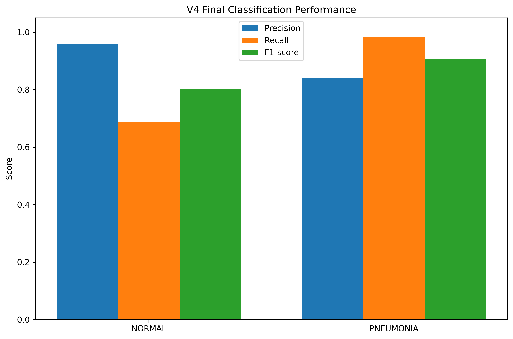
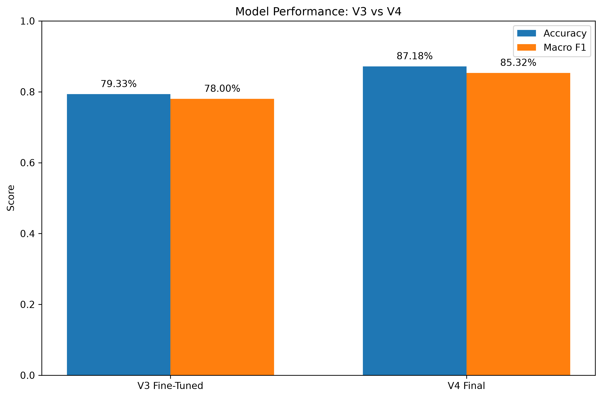
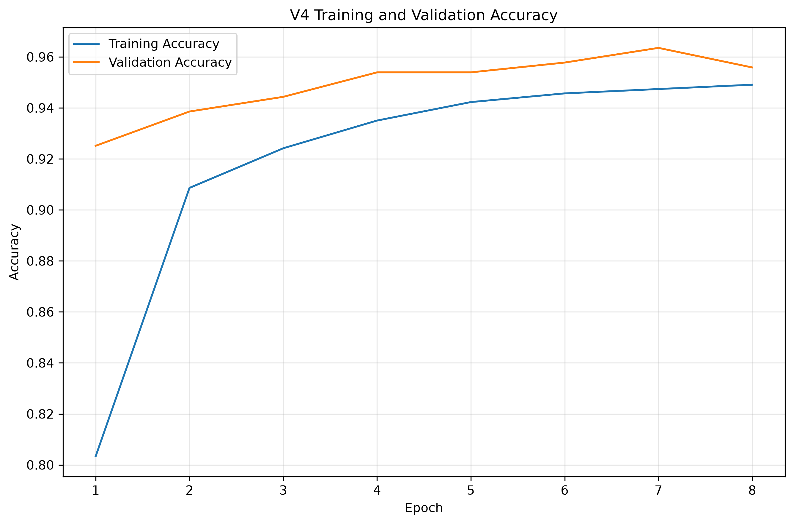
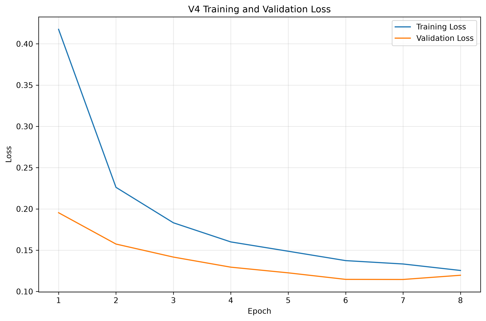

# LungAI

Final project for the Building AI course

## Summary

LungAI is a working AI prototype that classifies chest X-ray images as
`NORMAL` or `PNEUMONIA` using a fine-tuned MobileNetV2 model. It demonstrates
how computer vision could support medical-image review while making clear that
its predictions are educational research outputs, not medical diagnoses.

## Background

Pneumonia is assessed using clinical information and medical imaging, including
chest X-rays. Reviewing these images requires specialist knowledge, and errors
can have different consequences:

* a false negative classifies a pneumonia image as normal
* a false positive flags a normal image as pneumonia
* an imbalanced dataset can cause a model to favor one class
* high accuracy alone can hide poor performance for one class

My motivation was to turn the concepts covered in Building AI—classification,
neural networks, training data, overfitting, bias, and responsible AI—into a
working project with measurable results. LungAI therefore reports precision,
recall, F1-score, and a confusion matrix instead of relying only on accuracy.

## How is it used?

LungAI is used locally as a command-line research prototype. A user supplies a
chest X-ray image, the software converts it to the input format expected by the
model, and the model returns a `NORMAL` or `PNEUMONIA` classification together
with its pneumonia score and the decision threshold.

```text
Chest X-ray
    ↓
224 × 224 grayscale preprocessing
    ↓
Fine-tuned MobileNetV2
    ↓
Pneumonia score
    ↓
NORMAL / PNEUMONIA classification
```

Install and activate the environment from the repository root:

```bash
python3 -m venv .venv
source .venv/bin/activate
python -m pip install -r requirements.txt
```

Run a prediction:

```bash
python -m src.predict path/to/xray.jpeg
```

Evaluate the model on folders named `NORMAL/` and `PNEUMONIA/`:

```bash
python -m src.evaluate data/chest_xray/test
```

The intended users are AI students and researchers studying medical-image
classification. The prototype is not intended for patients, clinical diagnosis,
treatment, triage, or independent use by healthcare professionals.

### Final model results

The V4 model was evaluated on an untouched test set of 624 images using a
decision threshold of `0.60`.

| Metric | Result |
|---|---:|
| Accuracy | **87.18%** |
| Macro F1 | **85.32%** |
| NORMAL precision / recall / F1 | 95.83% / 68.80% / 80.10% |
| PNEUMONIA precision / recall / F1 | 83.99% / 98.21% / 90.54% |





The complete experimental process is available in
[`notebooks/01_first_test.ipynb`](notebooks/01_first_test.ipynb).

## Data sources and AI methods

The project uses the public
[Chest X-Ray Images (Pneumonia) dataset on Kaggle](https://www.kaggle.com/datasets/paultimothymooney/chest-xray-pneumonia),
which is organized into `NORMAL` and `PNEUMONIA` classes. The dataset was
collected by others; it is not included in this Git repository. Users must obtain
it from its original source and follow the dataset page's current terms and
licensing information.

| Split | Images |
|---|---:|
| Training | 4,695 |
| Validation | 521 |
| Test | 624 |
| Total | 5,840 |

The final approach uses:

* 224 × 224 grayscale input images
* grayscale-to-RGB conversion inside the model
* MobileNetV2 and ImageNet transfer learning
* random flip, rotation, and zoom augmentation
* class weights to reduce the impact of class imbalance
* dropout, early stopping, and learning-rate reduction
* fine-tuning of the final 30 MobileNetV2 layers
* validation-based selection of the `0.60` decision threshold
* accuracy, per-class precision/recall/F1, Macro F1, and confusion matrix







## Challenges

LungAI does **not** determine whether a patient has pneumonia. It only classifies
images according to patterns learned from one public dataset. Important
limitations and ethical considerations include:

* high pneumonia recall is accompanied by lower NORMAL recall and false positives
* the model has not been externally or clinically validated
* dataset imbalance and source-specific artifacts may affect predictions
* performance may change across hospitals, devices, populations, and image quality
* the sigmoid score is not a calibrated clinical probability
* patient privacy and informed data governance would be essential in real use
* automation bias could cause users to trust an incorrect prediction
* regulatory approval and expert oversight would be required for clinical use

**LungAI is an educational and research prototype. It is not a medical device and
must not be used for diagnosis, treatment, triage, or medical decision-making.**

## What next?

The project could be developed further by:

* validating the model on independent, multi-institutional datasets
* checking patient-level data separation and possible data leakage
* auditing performance across demographic groups and imaging devices
* adding probability calibration and confidence intervals
* reviewing incorrect classifications with qualified radiology professionals
* investigating clinically validated explainability methods
* adding out-of-distribution and low-quality-image detection
* building a privacy-aware demonstration interface

Progressing toward real medical research would require expertise and assistance
from radiologists, medical-data specialists, ethics and privacy professionals,
ML researchers, and regulatory experts.

## Acknowledgments

* Course: [Building AI by Reaktor Innovations and the University of Helsinki](https://buildingai.elementsofai.com/)
* Dataset: [Chest X-Ray Images (Pneumonia) by Paul Mooney on Kaggle](https://www.kaggle.com/datasets/paultimothymooney/chest-xray-pneumonia)
* Model architecture: [MobileNetV2](https://arxiv.org/abs/1801.04381), by Mark Sandler, Andrew Howard, Menglong Zhu, Andrey Zhmoginov, and Liang-Chieh Chen
* Software: [TensorFlow](https://www.tensorflow.org/), [Keras](https://keras.io/), [scikit-learn](https://scikit-learn.org/), NumPy, Matplotlib, and Pillow

The repository does not redistribute the chest X-ray dataset. Dataset users are
responsible for reviewing and following the original source's terms and licence.

## Repository structure

```text
LungAI/
├── notebooks/                 # Experiments, result plots, and final V4 model
├── src/                       # Reusable inference and evaluation commands
├── tests/                     # Lightweight inference contract tests
├── models/                    # Model-file documentation
├── data/                      # Local dataset; excluded from Git
├── requirements.txt
└── README.md
```

## Reproducibility

The saved V4 model is included for inference. Exact retraining results may vary
depending on hardware and library implementation. The reported final metrics use
the fixed 624-image test set and threshold `0.60`.
